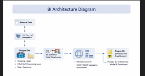
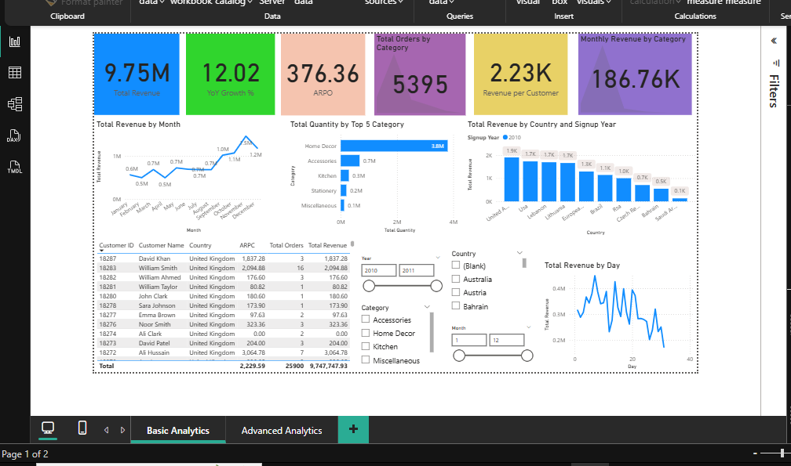
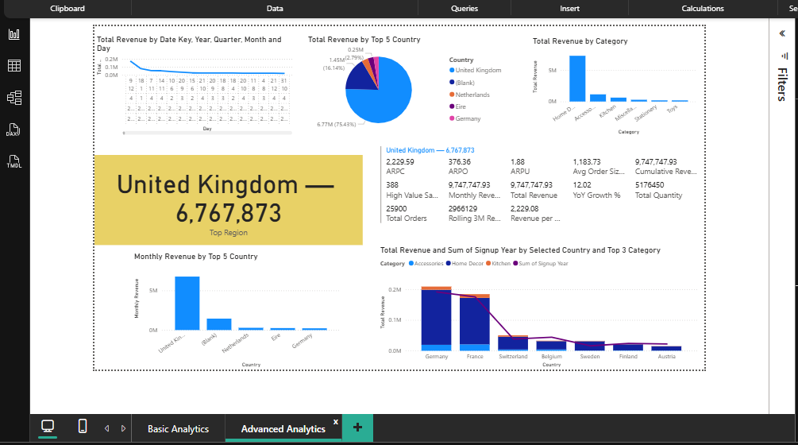

# 🛒 E-Commerce Data Warehouse & Power BI Analytics


A complete **Data Warehousing & Business Intelligence pipeline** built using **PostgreSQL and Power BI**.
The project demonstrates the implementation of a modern analytics architecture including **ETL/ELT pipelines, Star Schema modeling, OLAP queries, MOLAP aggregations, query optimization, and interactive dashboards**.

---

# 🚀 Project Highlights

✔ Designed a **Star Schema Data Warehouse** using PostgreSQL
✔ Implemented **ETL and ELT pipelines** for structured data processing
✔ Built **OLAP analytical queries** for multidimensional analysis
✔ Created **MOLAP pre-aggregation tables** to accelerate queries
✔ Evaluated **join algorithm performance** using `EXPLAIN ANALYZE`
✔ Developed an **interactive Power BI dashboard using DAX**

---

# 🎓 Academic Project Overview

This project was developed as part of a **Data Warehousing & Business Intelligence** university course.

The objective was to design and implement a **complete analytical environment** capable of supporting business intelligence reporting and performance analysis.

### Key Objectives

* Design a **Star Schema Data Warehouse**
* Implement **ETL & ELT pipelines**
* Perform **data validation and consistency checks**
* Execute **OLAP analytical queries**
* Build **MOLAP pre-aggregation tables**
* Evaluate **database join algorithm performance**
* Develop an **interactive Power BI dashboard**

---

# 📂 Repository Structure

```
ecommerce-data-warehouse-bi
│
├── README.md
├── .gitignore
│
├── data
│   └── dataset_link.txt
│
├── sql
│   ├── staging_tables.sql
│   ├── data_loading.sql
│   ├── data_warehouse_schema.sql
│   ├── etl_transformations.sql
│   └── molap_aggregations.sql
│
├── analysis
│   ├── olap_queries.sql
│   └── join_performance_analysis.sql
│
├── dashboard
│   └── ecommerce_dashboard.pbix
│
├── reports
│   └── project_report.pdf
│
└── images
    ├── architecture.png
    ├── dashboard_overview.png
    └── dashboard_kpis.png
```

This structure separates **data ingestion, transformation logic, analytical queries, dashboards, and documentation**.

---

# 🧱 System Architecture

```
System Architecture
│
├── Source Data
│   ├── CSV Files
│   └── Raw Tables
│
├── Staging Layer
│   └── PostgreSQL
│
├── ETL / ELT Processing Layer
│
├── Data Warehouse
│   └── Star Schema
│
├── Analytics Layer
│   ├── OLAP Queries
│   └── MOLAP Aggregation Tables
│
└── Visualization Layer
    └── Power BI Semantic Model & Dashboard
```

### Architecture Benefits

* Ensures **data quality and validation**
* Improves **analytical performance**
* Enables **scalable data modeling**
* Supports **business intelligence workloads**

---

# 🏗 Architecture Diagram



The system follows a **modern BI pipeline**:

1. Raw transactional data is ingested from CSV sources
2. Data is loaded into a **PostgreSQL staging layer**
3. ETL / ELT transformations prepare analytical datasets
4. Data is modeled using a **Star Schema Data Warehouse**
5. OLAP and MOLAP queries support analytics
6. Power BI connects to the warehouse for interactive dashboards

---

# 🗃️ Data Warehouse Design

The warehouse uses a **Star Schema** optimized for analytical queries.

### Fact Table

`fact_sales` – stores transactional sales data.

### Dimension Tables

* `dim_customer`
* `dim_product`
* `dim_date`

### Design Features

* Surrogate keys for dimensions
* Foreign key relationships
* Referential integrity enforcement
* Indexing for optimized analytical queries

---

# 🔄 Data Processing Pipelines

## ETL Workflow

Data is **extracted, transformed, and then loaded** into the data warehouse.

Typical steps include:

* Data extraction
* Data cleaning and transformation
* Loading into warehouse tables

---

## ELT Workflow (Primary Approach)

Raw data is first loaded into **PostgreSQL staging tables**, and transformations are performed using SQL.

Benefits:

* Utilizes database processing power
* Simplifies pipeline maintenance
* Supports flexible transformations

### Data Validation Checks

* Row count verification
* Revenue reconciliation
* Aggregation verification
* Data consistency validation

---

# 📊 Analytical Processing

## OLAP Queries

OLAP queries enable multidimensional business analysis such as:

* Monthly revenue trends
* Regional sales performance
* Product category analysis
* Customer behavior insights

---

## MOLAP Aggregations

To improve dashboard performance, **pre-aggregated tables** were created.

Examples include:

* Monthly revenue by region
* Monthly revenue by product category
* Customer lifetime revenue
* Order volume by country
* Product performance rankings
* Quarterly and yearly revenue summaries

These aggregations significantly reduce **query execution time for analytical workloads**.

---

# ⚡ Query Optimization & Performance Engineering

The project includes a detailed analysis of **PostgreSQL join algorithms**.

### Join Techniques Evaluated

* Nested Loop Join
* Hash Join
* Sort-Merge Join

Each method was evaluated using `EXPLAIN ANALYZE` on analytical queries involving:

* `fact_sales`
* `dim_customer`
* `dim_product`
* `dim_date`

### Metrics Evaluated

* Execution time
* Query planner cost
* Memory usage
* Join order
* Scan methods (Sequential vs Index scans)

This analysis helped determine the **most efficient join strategy for large fact-dimension joins**.

---

# 🚀 Indexing & Performance Optimization

To support fast analytical workloads, several indexing strategies were implemented.

### Fact Table Indexes

* `date_key`
* `product_key`
* `customer_key`

### Dimension Indexes

* `customer_id`
* `stock_code`
* `full_date`

### Composite Indexes

* `(date_key, product_key)`
* `(customer_key, date_key)`

### Maintenance Operations

* `ANALYZE`
* `VACUUM`

These optimizations reduced:

* Full table scans
* Query latency
* ETL processing time

---

# 📈 Power BI Dashboard

The Power BI dashboard provides **interactive analytics and business insights**.

### Dashboard Features

* KPI Cards

  * Revenue
  * Orders
  * Average Revenue per Order
  * Year-over-Year Growth

* Monthly revenue trend visualization

* Top regions and product categories

* Customer performance matrix

* Interactive filters and drill-down hierarchy

---

# 📊 Dashboard Preview

### Executive Dashboard



### KPI Metrics



---

# 🛠 Technologies Used

| Category        | Technology   |
| --------------- | ------------ |
| Database        | PostgreSQL   |
| Query Language  | SQL          |
| BI Tool         | Power BI     |
| Data Modeling   | Star Schema  |
| Analytics       | OLAP / MOLAP |
| Pipelines       | ETL / ELT    |
| Dashboard Logic | DAX          |

---

# 🚀 How to Run the Project

### 1️⃣ Create PostgreSQL Database

Create a new PostgreSQL database.

### 2️⃣ Execute SQL Scripts

Run the SQL scripts in the following order:

1. Staging table creation
2. Data loading scripts
3. Data warehouse schema creation
4. ETL / ELT transformation queries
5. MOLAP aggregation tables

### 3️⃣ Connect Power BI

1. Open **Power BI Desktop**
2. Connect to **PostgreSQL**
3. Import Data Warehouse tables
4. Load the `ecommerce_dashboard.pbix` file

---

# 🔮 Future Improvements

* Incremental ETL pipelines
* Real-time data ingestion
* Partitioned fact tables
* Cloud data warehouse deployment
* Automated workflow scheduling

---

# 👤 Author

**Ali Ahmad**
BS Data Science

---

⭐ If you find this project useful, consider **starring the repository**.
